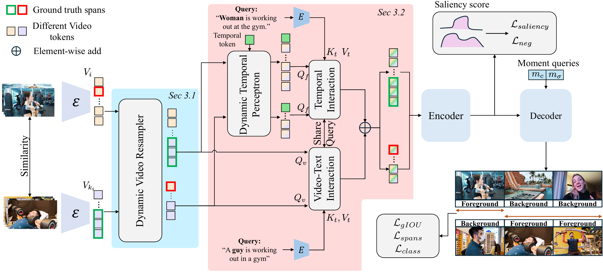

# TD-DETR

[The Devil is in the Spurious Correlations: Boosting Moment Retrieval with Dynamic Learning](https://arxiv.org/abs/2501.07305)

[Xinyang Zhou*](https://scholar.google.com/citations?user=yvw4X_sAAAAJ), [Fanyue Wei*](https://wfanyue.github.io/), [Lixin Duan](https://scholar.google.com/citations?user=inRIcS0AAAAJ), [Angela Yao](https://www.comp.nus.edu.sg/~ayao/), [Wen Li](https://wenli-vision.github.io/)

$*$ Equal Contribution

## LICENSE
The codes are under [MIT](https://opensource.org/license/MIT) license.
