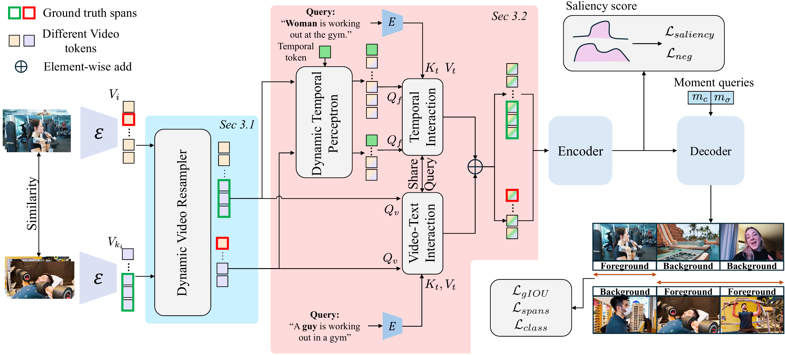

# TD-DETR [ICCV 25]: The Devil is in the Spurious Correlations: Boosting Moment Retrieval with Dynamic Learning

<a href='https://arxiv.org/abs/2501.07305'></a>

[The Devil is in the Spurious Correlations: Boosting Moment Retrieval with Dynamic Learning](https://arxiv.org/abs/2501.07305)

[Xinyang Zhou\*](https://scholar.google.com/citations?user=yvw4X_sAAAAJ), [Fanyue Wei\*](https://wfanyue.github.io/), [Lixin Duan](https://scholar.google.com/citations?user=inRIcS0AAAAJ), [Angela Yao](https://www.comp.nus.edu.sg/~ayao/), [Wen Li](https://wenli-vision.github.io/)

$*$ Equal Contribution

This repo contains the official code of our ICCV2025 paper: [The Devil is in the Spurious Correlations: Boosting Moment Retrieval with Dynamic Learning]



<!-- ## Abstract -->
<!-- Given a textual query along with a corresponding video, the objective of moment retrieval aims to localize the moments relevant to the query within the video. While commendable results have been demonstrated by existing transformer-based approaches, predicting the accurate temporal span of the target moment is still a major challenge. This paper reveals that a crucial reason stems from the spurious correlation between the text query and the moment context. Namely, the model makes predictions by overly associating queries with background frames rather than distinguishing target moments. To address this issue, we propose a dynamic learning approach for moment retrieval, where two strategies are designed to mitigate the spurious correlation. First, we introduce a novel video synthesis approach to construct a dynamic context for the queried moment, enabling the model to attend to the target moment of the corresponding query across dynamic backgrounds. Second, to alleviate the over-association with backgrounds, we enhance representations temporally by incorporating text-dynamics interaction, which encourages the model to align text with target moments through complementary dynamic representations. With the proposed method, our model significantly alleviates the spurious correlation issue in moment retrieval and establishes new state-of-the-art performance on two popular benchmarks, \ie, QVHighlights and Charades-STA. In addition, detailed ablation studies and evaluations across different architectures demonstrate the generalization and effectiveness of the proposed strategies. Our code will be publicly available. -->

<!-- ## BibTex -->

## Prerequisites

### 0. Clone this repo

### 1. Datasets

We use the features from [Moment-DETR](https://github.com/jayleicn/moment_detr) and [CG-DETR](https://github.com/wjun0830/CGDETR).

> <b> [QVHighlights](https://drive.google.com/file/d/1Hiln02F1NEpoW8-iPZurRyi-47-W2_B9/view?usp=sharing) </b> md5: e07e50947226e01b1bd74122d6695c3c <br> <b> [Charades-STA](https://drive.google.com/file/d/1B2721QC799qbbGLGSa7DkXJjdRefvZf-/view?usp=sharing) </b> md5: 262823450cd253c84f4afeb3f5e43170 <br> <b> [TACoS](https://drive.google.com/file/d/1_IaKMjKw3nNaSsvN28ZucfM4K-ivZTHw/view?usp=sharing) </b> md5: 8aa001f389bb57e5db0ab58a34dcfe9f <br>

After downloading, you can change 'feat_root' in shell files under `td_detr/scripts/*/`.

### 2. Similarity Matrix
In `Section 3.1: Video Synthesizer`, we develop a `Similarity based Spurious Pair Selection`. To reduce the repeated calculations, we precalculated the similarity matrix and upload to [google drive](https://drive.google.com/file/d/1KBNccxC8Z7Pv46-n6oyUL5vfnOMLHTkL/view?usp=sharing). We suggest either download and unzip them into `similarity/` or modify the `--sim_matrix_path` option in shell files under `td_detr/scripts/*/`.

### 3. Dependencies
Creating conda environment and installing all the dependencies as follows:

```Shell
# create conda env
conda create --name td_detr python=3.7
# activate env
conda actiavte td_detr
# install other python packages
pip install torch==1.9.1+cu111 torchvision==0.10.1+cu111 torchaudio==0.9.1 torchtext==0.10.1 -f https://download.pytorch.org/whl/torch_stable.html
pip install -r requirements.txt
```

### 4. Training & Evaluation

#### QVHighlights

```Shell
# Training
bash td_detr/scripts/train.sh
# Eval
bash td_detr/scripts/inference.sh
```

#### Charades-STA

```Shell
# Training
bash td_detr/scripts/charadesSTA/train_charades.sh
# Eval
bash td_detr/scripts/charadesSTA/inference_charades.sh
```

#### TACoS

```Shell
# Training
bash td_detr/scripts/tacos/train_tacos.sh
# Eval
bash td_detr/scripts/tacos/inference_charades.sh
```


## LICENSE

The codes are under [MIT](https://opensource.org/license/MIT) license.
